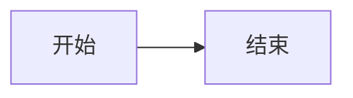
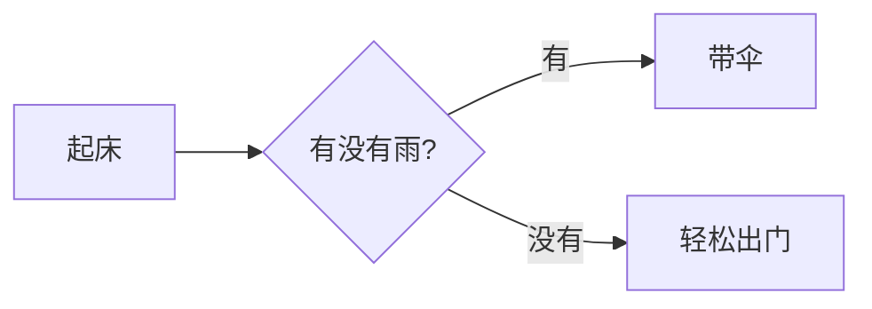

# 第 4 章 快速上手

> 本章导读：仓库已经就位，现在轮到你亲手画出第一张图了。本章介绍两种最省事的起步方式：一种是用 CDN 零安装，打开浏览器就能画图；另一种是用本地开发服务器浏览仓库自带的演示页。最后，我们会一起写一段最简单、却完整可用的流程图，让你亲眼看到"文本变成图片"的魔法。学完之后，你将能够独立产出自己的第一张 Mermaid 图。

再次提醒：**本教程不需要你亲手敲任何终端命令**。下载、安装、启动等操作，你只要把下面带引号的话原样发给智能体（例如 hermes agent）即可。

---

## 4.1 方式一：CDN 零安装（最简单）

**CDN（内容分发网络）**可以理解为一个网上的"公共厨房"：你不需要在自己电脑上安装 Mermaid，只要在网页里引用一个网上链接，就能直接用上它。这对只想快速画张图、不想折腾环境的读者来说，是最轻松的路径。

下面是一份完整、可直接用的 HTML 例子。请把它整段复制，保存成一个以 `.html` 结尾的文件（比如命名为 `first.html`），然后用浏览器打开它：

```html
<!DOCTYPE html>
<html lang="zh-CN">
<head>
  <meta charset="UTF-8" />
  <title>我的第一个 Mermaid 图</title>
</head>
<body>
  <pre class="mermaid">
    graph LR
      A[开始] --> B[处理中]
      B --> C[结束]
  </pre>

  <script type="module">
    import mermaid from 'https://cdn.jsdelivr.net/npm/mermaid@11/dist/mermaid.esm.min.mjs';
    mermaid.initialize({ startOnLoad: true });
    mermaid.run();
  </script>
</body>
</html>
```

这段代码做了三件事：

1. 在 `<pre class="mermaid">` 里，用 Mermaid 的图定义文本（也就是"喂给 Mermaid 的原料"）描述了一张**从左到右的流程图**（关键词 `graph LR`，LR 即 Left-to-Right）。
2. 用 `<script type="module">` 从 CDN 引入 `https://cdn.jsdelivr.net/npm/mermaid@11/dist/mermaid.esm.min.mjs`（注意版本号是 **mermaid 11.x**，文件是 ESM 压缩版）。
3. 调用 `mermaid.initialize` 与 `mermaid.run()`，让 Mermaid 自动扫描页面、把文本**渲染（render）**成图片。

> **重要避坑**：自动渲染时，Mermaid 默认寻找的是带 `class="mermaid"` 的元素（`<pre>` 或 `<div>` 都可以），**而不是**一个叫 `<mermaid>` 的标签。网上有些过时写法会写成 `<mermaid>...</mermaid>`，那是不对的，请始终用 `class="mermaid"`。

按上面保存到 `.html` 文件并用浏览器打开后，你预期会看到：页面上自动出现一个**从左到右排列的流程图**，三个方框依次写着"开始""处理中""结束"，彼此用箭头连起来。整个过程你什么构建都不用做，全靠 CDN 这个"公共厨房"现做现卖。

---

## 4.2 方式二：本地开发服务器预览仓库演示

如果你已经按《03-获取与安装.md》装好了依赖，那么还有一种很棒的玩法：启动仓库自带的开发服务器，浏览里面丰富的示例。这能让你看到 Mermaid 支持的几十种图长什么样，还能实时改图、即时看效果。

请对你的智能体说：

> 对智能体说："请在 D 盘的 mermaid-develop 文件夹里启动开发服务器（dev）。"

智能体会启动一个本地开发服务器，并在后台持续运行。启动完成后，你在浏览器地址栏输入 `http://localhost:9000`，就能看到仓库里的 **`demos/` 演示页**——每一种图（流程图、时序图、类图、思维导图等）都有一个独立的 HTML 演示页，点进去就能看到真实渲染的效果。

如果一切顺利，你会看到浏览器里出现演示首页，左侧或页面上列出各种图类型的入口，点开任意一项都能看到对应的成品图。

更妙的是，在浏览器打开 `http://localhost:9000/dev/` 会进入 **Dev Explorer**（开发探索器）——这是仓库自带的本地调试界面。在这里你可以实时编辑 `.mmd` 文本（`.mmd` 是 Mermaid 图定义文件常用的扩展名），左边改字、右边立刻出图，特别适合边学边试。

> 小提示：`demos` 是仓库里 `demos/` 文件夹的演示页；Dev Explorer 就是上面这个 `http://localhost:9000/dev/` 实时编辑界面。两者都靠本地开发服务器提供，无需单独安装。

预期结果：你在 `http://localhost:9000` 浏览各种图的成品示例，在 `http://localhost:9000/dev/` 实时修改 `.mmd` 文本并即时看到图的变化——就像拥有一个随写随画的画板。

---

## 4.3 你的第一个图

无论你选了上面哪种方式，现在我们都来写一段**最简单、却完整可用**的流程图，亲手体会"文本变图片"。

请把下面这段图定义文本，放进你的 HTML 的 `class="mermaid"` 元素里（或贴进 Dev Explorer 的编辑框）：



我们来逐部分拆开看：

- `graph LR`：声明"这是一张图"，并且方向是 **LR（Left to Right，从左到右）**。如果你写成 `graph TD`，则是自上而下（Top Down）。
- `A[开始]`：定义一个**节点**，代号是 `A`，方框里显示的文字是"开始"（`[ ]` 表示圆角矩形框）。
- `-->`：表示一条带箭头的连线，从左边的节点指向右边的节点。
- `B[结束]`：再定义一个节点，代号 `B`，文字"结束"。

整句连起来的意思就是：画一张从左往右的图，左边一个"开始"框，右边一个"结束"框，中间用箭头连起来。

**预期你会看到**：页面上出现两个并排的方框，左边写着"开始"，右边写着"结束"，两者之间有一条向右的箭头。这就是你的第一张 Mermaid 图——而你只写了一行半文字。

想再试一个稍丰富的？把文本换成：



这里 `{ }` 表示菱形判断框，`|有|` / `|没有|` 是标在连线上的分支文字。渲染后你会看到一张带判断分支的小流程图。多改几次、多刷新几次，你很快就能掌握图定义文本的基本节奏。

---

## 本章小结

本章我们实打实地迈出了第一步：

1. **CDN 零安装**：用一份 HTML + 一个 CDN 链接就能画图，关键是 `class="mermaid"` 这个选择器（不是 `<mermaid>` 标签），以及 `mermaid 11.x` 的 ESM 链接。
2. **本地开发服务器**：装好依赖后启动 dev，浏览器开 `http://localhost:9000` 看 `demos/` 演示、`http://localhost:9000/dev/` 进 Dev Explorer 实时编辑。
3. **第一个图**：用 `graph LR` 写出最简单的流程图，理解了节点、连线、方向的含义，并看到了"文本变图片"的结果。

你已经能让 Mermaid 听你指挥画图了。不过，你或许会好奇：明明只给了它一段文字，它凭什么能准确画出图？背后是谁在"读懂"你的语法、又是谁在决定节点摆在哪里？下一章，我们就来揭开 Mermaid 的内部结构——想了解原理的话，请继续阅读第 5 章"架构概览"。
