# 第 7 章 流程图 flowchart 语法详解

> 本章导读：流程图（flowchart）是 Mermaid 里最常用、也最适合零基础入门的一种图。它能把"先做 A、再判断 B、条件成立走左边、不成立走右边"这类步骤清晰地画出来，特别适合画操作步骤、业务流程和审批流。学完本章，你将能独立写出一张带分支判断、带子图、还能点击跳转的流程图。

说明：本教程不需要你亲手敲任何命令。所有"操作"都写成对智能体（例如 hermes agent）说的话，你只要把引号里的内容原样发给智能体即可。如果你还没准备好预览环境，可先阅读《04-快速上手.md》了解如何打开实时预览。

## 7.1 流程图是什么

流程图由"节点"和"连线"组成。节点是图里一个个方框，代表一个步骤或一个判断；连线是节点之间的箭头，表示"下一步去哪里"。你可以把流程图想象成一张"做菜步骤卡"：每个步骤一个格子，箭头告诉你先做什么、后做什么。

在 Mermaid 里，流程图有两种声明写法：`graph` 和 `flowchart`。它们功能几乎一样，本教程统一用 `flowchart`，这是较新的写法。

## 7.2 声明一张流程图：方向与起点

写流程图的第一行要告诉 Mermaid 两件事：这是一张流程图，以及它朝哪个方向展开。语法是：

```mermaid
flowchart 方向
```

方向有四种，记不住可以联想英文：

- `TB` 或 `TD`：Top Bottom，从上往下排。
- `BT`：Bottom Top，从下往上排。
- `LR`：Left Right，从左往右排。
- `RL`：Right Left，从右往左排。

下面是一张最简单的从左到右的流程图：

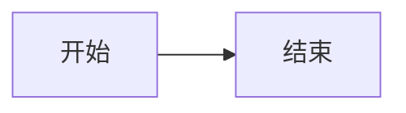

预期效果：画出一个横向的图，左边一个矩形写着"开始"，右边一个矩形写着"结束"，中间一条带箭头的线把两者连起来，箭头指向"结束"。

小提示：节点之间要用换行或分号隔开；本教程用换行，更清晰。

想立刻看到效果？把上面的文本交给智能体：

> 对智能体说："请把这段 Mermaid 流程图文本渲染成图片，让我预览效果。"

如果一切顺利，你会看到上面描述的横向两框图。

## 7.3 节点形状：用不同的"括号"画出不同的框

流程图有趣的地方是：换一种括号，框的形状就变了。Mermaid 用 `节点id[内容]` 的形式表示节点，括号决定了"长什么样"。下面逐个介绍。

### 矩形（最常用，表示步骤）

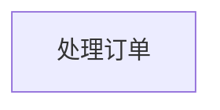

预期：画出一个普通矩形，里面写"处理订单"。矩形最适合表示"做一件事"。

### 圆角矩形（表示开始、结束或流程）

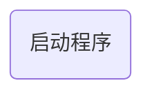

预期：画出一个四角圆润的矩形，里面写"启动程序"。

### 体育场形（两端半圆的长条，常用于起止）

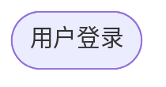

预期：画出一个像运动场、胶囊形状的框，两头是半圆。

### 菱形（判断节点，里面放"是/否"问题）

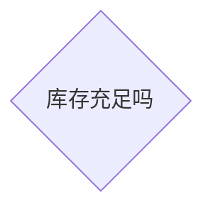

预期：画出一个菱形，里面写"库存充足吗"。菱形专门用来表示"判断"，通常引出两条线：成立走一边，不成立走另一边。

### 圆形（表示连接点或起止）

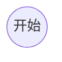

预期：画出一个正圆，里面写"开始"。

### 非对称形（旗帜状，常用于说明）

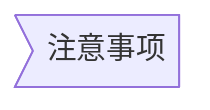

预期：画出一个右边带尖角的旗帜形状框，里面写"注意事项"。

### 六边形（表示准备或输入）

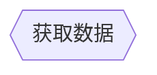

预期：画出一个六边形框，里面写"获取数据"。

### 平行四边形（表示输入/输出）

有两种写法，斜杠方向不同：

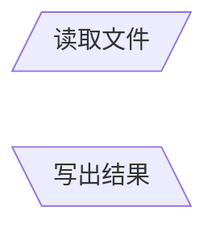

预期：画出两个平行四边形，第一个左边低右边高（像 `/`），写"读取文件"；第二个左边高右边低（像 `\`），写"写出结果"。

### 梯形（表示人工操作或流程边界）

也有两种方向：

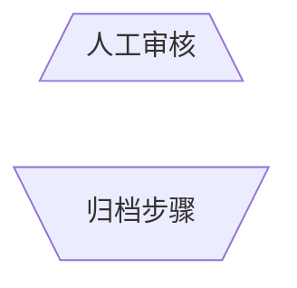

预期：画出两个梯形框，方向互为镜像，可用来表示人工环节或流程边界。

记住一个规律：括号决定了"长什么样"，括号里的内容决定了"写什么字"。

## 7.4 连线类型：箭头、虚线、粗线、带文字

节点之间用什么线连，决定了图的语义。下面是常用连线。

### 箭头连线 `-->`

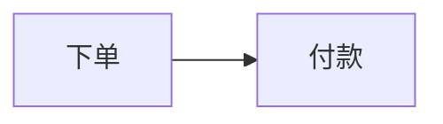

预期：A 到 B 一条带实心箭头的实线，表示"下一步"。

### 无箭头连线 `---`

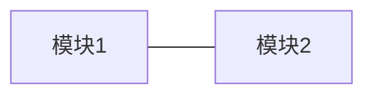

预期：一条没有箭头的实线，仅表示"两者相关"。

### 带文字标签 `-- 文字 -->`

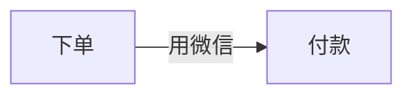

预期：箭头线中间出现小字"用微信"，说明这一步用什么方式完成。

### 虚线箭头 `-.->`

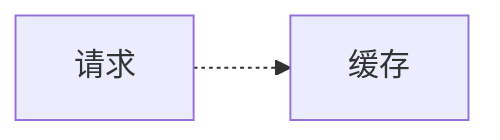

预期：一条虚线带箭头，常表示"可选"或"间接"关系。

### 粗箭头 `==>`

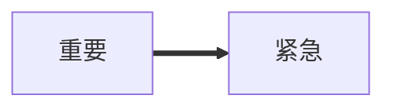

预期：一条加粗的箭头线，用来强调关键路径。

### 虚线带标签 `-. 文字 .->`

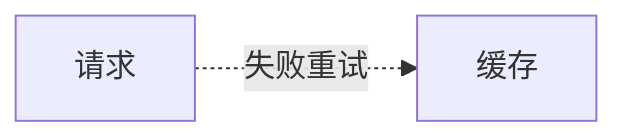

预期：虚线中间写"失败重试"。

### 粗线带标签 `== 文字 ==>`

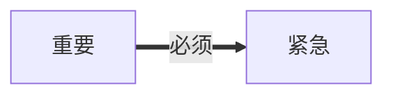

预期：粗箭头中间写"必须"。

判断分支的常见写法：

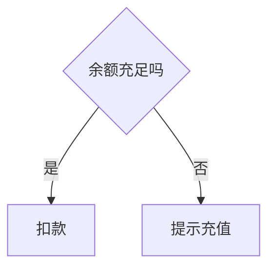

预期：上方一个菱形"余额充足吗"，向下引出两条带标签的箭头：一条标"是"指向"扣款"，一条标"否"指向"提示充值"。这就是典型的分支判断。

## 7.5 子图与布局方向

当图变大，可以用 `subgraph ... end` 把一组节点框在一个大框里，代表"一个模块"。语法：

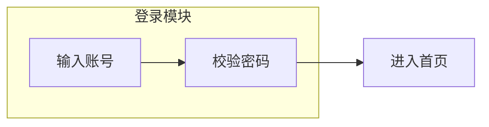

预期：左边一个大框，标题"登录模块"，里面有两个矩形"输入账号""校验密码"并用箭头相连；大框外面右边是"进入首页"，登录模块整体连向它。

子图内部也可以单独指定方向，用 `direction`：

```mermaid
flowchart LR
    subgraph 处理
        direction TB
        A[读] --> B[算]
    end
```

预期：这个子图内部改成从上往下排，而不受外层 LR 影响。

## 7.6 样式与交互：让图更漂亮、能点击

### 定义样式类 classDef

`classDef` 用来定义一套样式（颜色等），格式：`classDef 类名 样式`。

```mermaid
flowchart LR
    classDef 危险 fill:#fdd,stroke:#f00
    A[删除]:::危险
```

预期：节点"删除"底色变浅红、边框变红。"危险"是你自定义的样式名，`:::危险` 表示应用它。

### 应用样式 class

也可以先定义、再批量应用：

```mermaid
flowchart LR
    classDef 蓝 fill:#ddf
    A[甲] --> B[乙]
    class A,B 蓝
```

预期：甲、乙两个节点都变成浅蓝底。

### 直接改样式 style

想只改一个节点，用 `style`：

```mermaid
flowchart LR
    A[重点] --> B[普通]
    style A fill:#ff9,stroke-width:4px
```

预期：只有"重点"节点变黄、边框加粗。

### 点击交互 click

让节点可点击跳转网页，需打开安全级别。在图定义文本开头加 init 指令，并用 `click`：

```mermaid
%%{init: {'securityLevel':'loose'}}%%
flowchart LR
    A[打开官网] --> B[浏览]
    click A "https://mermaid.js.org" _blank
```

预期：点击"打开官网"节点会在新标签页打开官方文档站。注意：默认安全级别是 `strict`，会禁用点击，所以这里必须写 `securityLevel:'loose'`（详见术语表中的"安全级别"）。

## 7.7 综合示例

把上面学的组合起来：

```mermaid
%%{init: {'securityLevel':'loose'}}%%
flowchart TD
    classDef 起点 fill:#dfd,stroke:#0a0
    classDef 终点 fill:#fdd,stroke:#a00

    Start([开始]):::起点 --> Input[/输入用户名/]
    Input --> Check{格式正确吗}
    Check -- 是 --> Query[查询数据库]
    Check -- 否 --> Input
    Query --> Ok[登录成功]
    Ok --> End([进入系统]):::终点

    subgraph 后台
        direction LR
        Query
    end

    click End "https://mermaid.js.org" _blank
```

预期效果：一张从上往下的图。顶部绿色胶囊"开始"连到平行四边形"输入用户名"；再连到菱形"格式正确吗"。菱形向下分两路：标"是"指向"查询数据库"，标"否"绕回"输入用户名"（形成重新输入的小回路）。"查询数据库"被一个标题为"后台"的大框圈住，并横向排列。之后连到"登录成功"，再连到底部红色胶囊"进入系统"。点击"进入系统"会打开官方文档站。这张图完整展示了"带判断、带回路、带子图、带样式、可点击"的流程图。

## 本章小结

本章你学会了流程图的核心语法：用 `flowchart 方向` 声明；用不同括号画出矩形、圆角、菱形、圆形等节点；用 `-->`、`---`、`-.->`、`==>` 等画出各种连线；用 `subgraph` 分组；用 `classDef`/`class`/`style` 美化；用 `click` 加交互。流程图是表达"步骤与判断"的利器。

下一章（第 8 章）我们将学习另一种高频图——时序图（sequenceDiagram）。如果说流程图讲的是"一步一步怎么做"，时序图讲的则是"几个人或系统之间，按时间顺序怎么对话"，非常适合画接口调用和协作流程。
