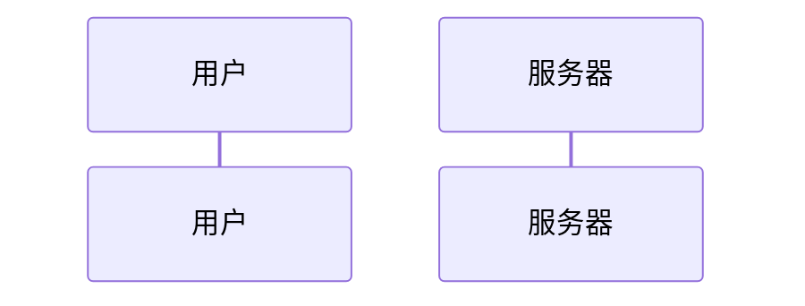
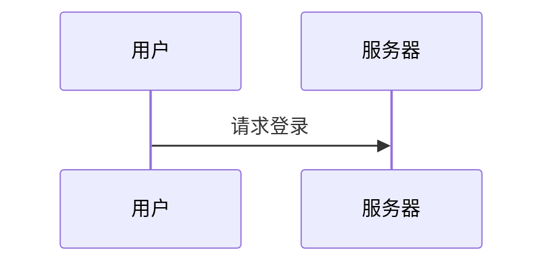
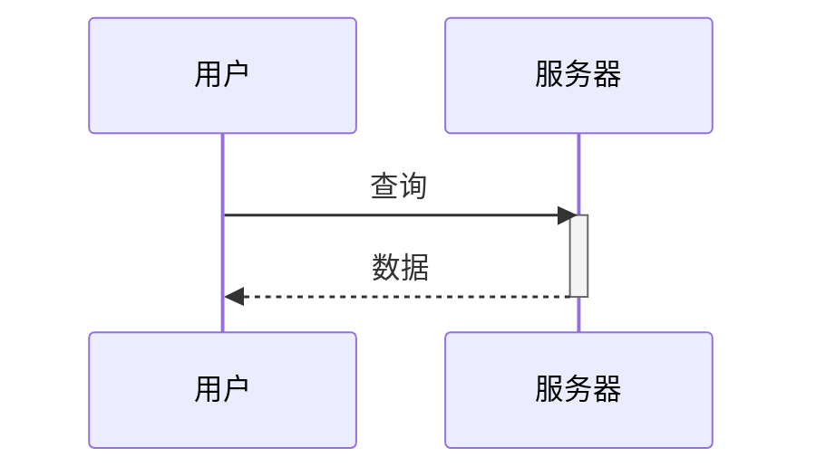

# 第 8 章 时序图 sequenceDiagram 语法详解

> 本章导读：时序图（sequence diagram）用来展示"多个角色之间，随着时间推移，谁先说话、谁后回应"。它最适合画接口调用、系统协作和对话流程。学完本章，你能写出带参与者、消息、激活条和分支逻辑的完整时序图。

说明：本教程不需要你亲手敲任何命令。所有"操作"都写成对智能体（例如 hermes agent）说的话，你只要把引号里的内容原样发给智能体即可。如果你还没准备好预览环境，可先阅读《04-快速上手.md》了解如何打开实时预览。

## 8.1 时序图是什么

时序图里有几条竖着的"生命线"，每条线顶上一个角色（人或系统）。时间从上往下流，角色之间用横线箭头互相发消息。想象一群人在群里聊天，从上往下一句句看，就是时序图的读法。

## 8.2 声明与参与者

第一行写 `sequenceDiagram` 声明这是时序图。然后用 `participant` 定义参与者，可用 `as` 起别名：



预期：画出两条竖直生命线，顶部分别标"用户"和"服务器"（U、S 是内部代号，显示用别名）。

除了 `participant`，还有更形象的角色类型：

```mermaid
sequenceDiagram
    actor 顾客
    participant 店员
    Database 库存库
```

预期："顾客"显示为小人图标，"店员"是普通矩形，"库存库"显示为数据库圆柱图标。用 `actor` 表示人，`Database` 表示数据库，更直观。参与者写的先后顺序，也决定它们从左到右的排列顺序。

## 8.3 消息连线

消息写在参与者之间，冒号后面是内容。几种箭头语义不同。

### 实线箭头（同步消息）`->>`



预期：从"用户"生命线向"服务器"画一条实心箭头横线，线上写"请求登录"，表示用户主动发请求。

### 实线无箭头 `->`

```mermaid
    U->S: 通知
```

预期：一条实线但没有箭头尖，表示单向通知、不强调返回。

### 虚线箭头（返回消息）`-->>`

```mermaid
    S-->>U: 返回结果
```

预期：一条虚线箭头从服务器指回用户，通常表示"响应/返回"。

### 虚线无箭头 `-->`

```mermaid
    S-->U: 心跳
```

预期：虚线无尖头，表示松散的告知。

### 进入/退出激活栈 `->>+` 和 `->>-`

加号表示"对方开始忙（进入激活）"，减号表示"忙完（退出激活）"：

```mermaid
    U->>+S: 下单
    S->>-U: 下单成功
```

预期：服务器在收到"下单"后、返回前，生命线上出现一段细长的激活条，表示它正在处理；返回后激活条消失。

带标签的写法统一为 `A->>B: 文字`，冒号后写任意文字即可。

## 8.4 激活条

除了用 `->>+` 自动开关，也可以手动控制：



预期：服务器收到"查询"后出现激活条，发回"数据"后激活条消失。`activate`/`deactivate` 让你精确控制哪段期间"正在处理"。

## 8.5 注释

用 `Note` 在图上加说明文字：

```mermaid
    Note right of U: 用户已登录
    Note left of S: 内部校验
    Note over U,S: 一次完整交互
```

预期：第一句在用户生命线右侧加一个便签"用户已登录"；第二句在服务器左侧加便签；第三句横跨用户和服务器两个生命线、顶部写"一次完整交互"。`Note over A,B` 能把备注覆盖多个角色。

## 8.6 组合片段：循环、分支与并行

时序图能用块语法表达逻辑结构，都以关键字开头、`end` 结尾。

### loop 循环

```mermaid
    loop 每 5 秒
        U->>S: 轮询状态
        S-->>U: 当前状态
    end
```

预期：一段被方框框住、左上角标"loop 每 5 秒"的区域，里面是反复发生的轮询消息。

### alt 二选一（带 else）

```mermaid
    alt 余额充足
        S-->>U: 扣款成功
    else 余额不足
        S-->>U: 提示充值
    end
```

预期：一个标"alt"的方框，分上下两栏，分别标"余额充足"和"余额不足"，对应两种不同返回。这是画分支最常用的结构。

### opt 可选

```mermaid
    opt 首次登录
        S-->>U: 引导教程
    end
```

预期：标"opt 首次登录"的方框，表示"仅在首次登录时才发生"的可选步骤。

### par 并行

```mermaid
    par 上传图片
        U->>S: 图片A
    and 上传视频
        U->>S: 视频B
    end
```

预期：标"par"的方框，分两栏"上传图片""上传视频"，表示两件同时发生。

### rect 上色背景

```mermaid
    rect rgb(200,220,255)
        U->>S: 关键步骤
    end
```

预期：一段被淡蓝底框住的区域，用来高亮某段交互。颜色可用 `rgb(...)` 或 `#RRGGBB`。

## 8.7 综合示例

```mermaid
sequenceDiagram
    actor 用户
    participant 网关 as API网关
    participant 服务 as 订单服务
    Database 订单库

    用户->>+网关: 提交订单
    网关->>+服务: 创建订单
    activate 服务
    服务->>订单库: 写入
    订单库-->>服务: 已保存
    deactivate 服务
    服务-->>-网关: 订单号
    网关-->>-用户: 下单成功

    alt 库存不足
        网关-->>用户: 提示补货
    else 库存充足
        网关-->>用户: 进入支付
    end

    Note over 用户,订单库: 一次完整下单流程
```

预期效果：图上从左到右四条生命线，分别是"用户"（小人）、"API网关"、"订单服务"、"订单库"（圆柱）。用户向网关发"提交订单"并激活网关；网关再激活订单服务并转发"创建订单"；订单服务向数据库"写入"并收到"已保存"返回；随后订单服务、网关依次退出激活，并把"订单号""下单成功"沿虚线返回给用户。接着一个 `alt` 方框给出两种结局：库存不足提示补货，库存充足进入支付。最底部一条横跨四方的备注"一次完整下单流程"。整张图清晰呈现了一次下单里"谁调用谁、何时激活、分支如何"的全过程。

想看这张图渲染出来什么样？把上面的文本交给智能体：

> 对智能体说："请把这段 Mermaid 时序图文本渲染成图片，让我预览效果。"

## 本章小结

本章你掌握了时序图的语法：用 `sequenceDiagram` 声明；用 `participant`/`actor`/`Database` 定义角色；用 `->>`、`-->>`、`->>+` 等画出各类消息与激活；用 `Note` 加备注；用 `loop`/`alt`/`opt`/`par`/`rect` 表达循环、分支、并行与高亮。时序图是梳理"多角色协作"的最佳工具。

下一章（第 9 章）我们将继续学习 Mermaid 的其他常用图型，进一步扩展你的画图能力，敬请期待。
