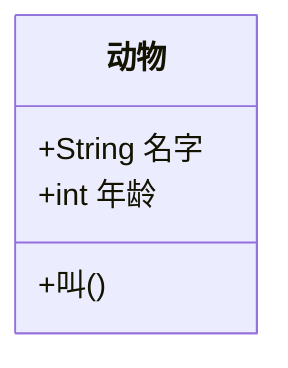
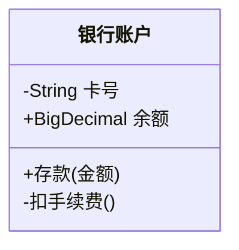
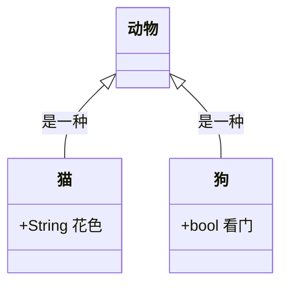
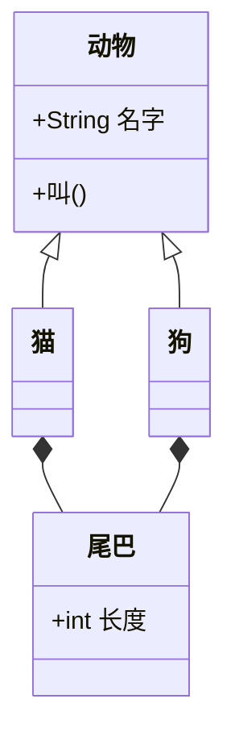
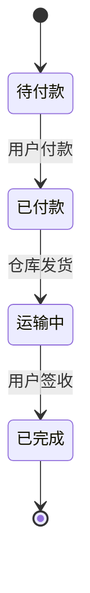
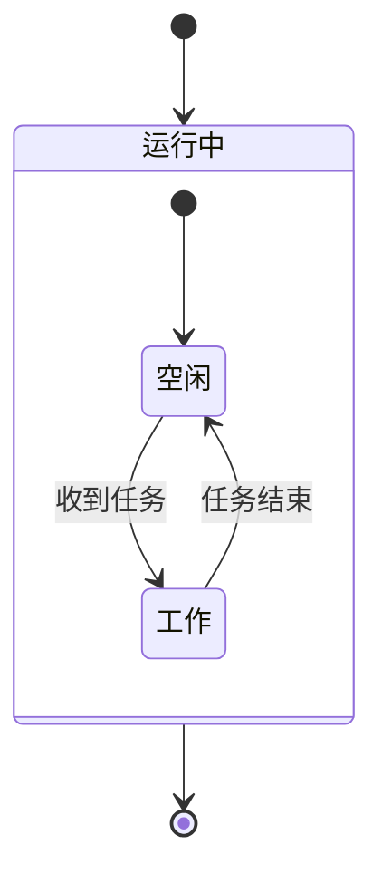
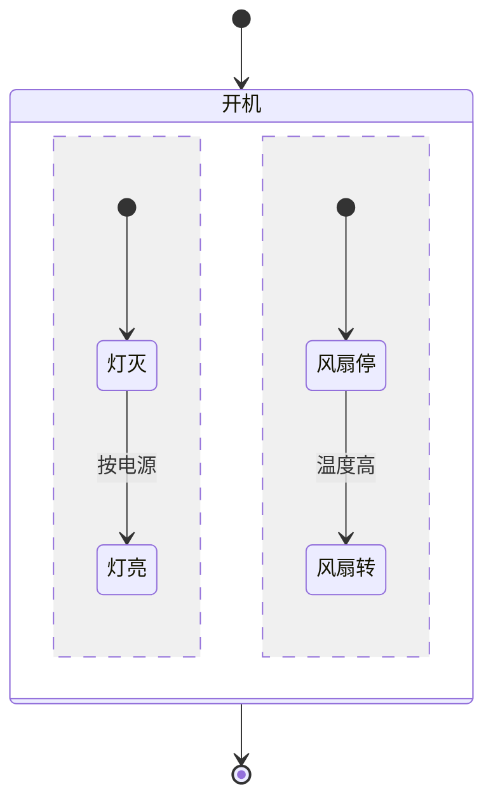
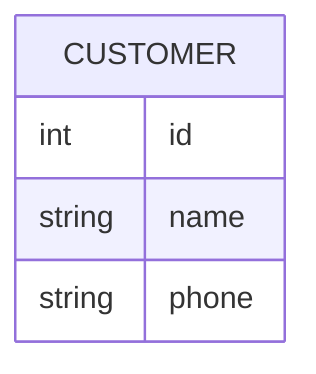
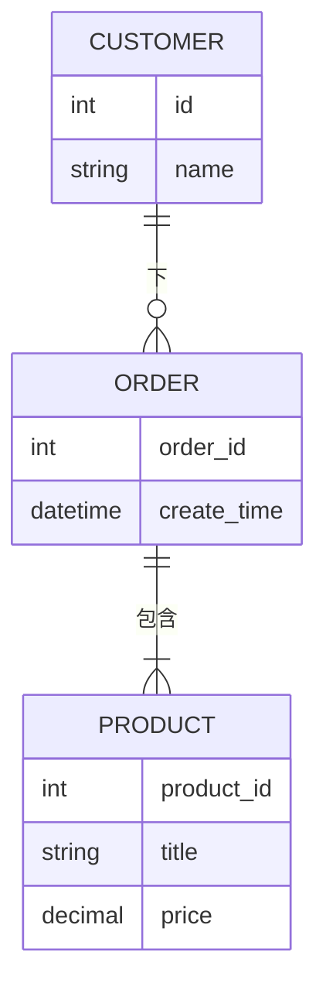

# 第 9 章 类图 / 状态图 / ER 图（静态结构类图）

> 本章导读：前面几章我们认识了流程图、时序图等"动态"图。这一章带你认识三类"静态结构"图——它们不描述动作怎么流动，而是描述"东西本身长什么样、彼此有什么关系"。学完之后，你可以用类图梳理代码结构、用状态图描述一个系统会经历哪些状态、用 ER 图规划数据库里表与表的关系。

在动手之前先说一句：本教程从头到尾都不需要你亲手敲任何命令。当你看到"对智能体说"这一段时，只要把引号里的话原样发给智能体（例如 hermes agent）即可，它会替你把图渲染出来。本章每个例子都是一段**图定义文本**（也就是喂给 Mermaid 的"原料"），你把它交给智能体，就能看到渲染后的图片（SVG）。

## 9.1 类图 classDiagram

### 它是什么

类图（class diagram）来自一套叫 UML（统一建模语言）的画图标准，是面向对象世界里最基础的"静态结构图"。打个比方：如果我们要设计一款宠物游戏，猫和狗都是"动物"，它们都有名字、都会叫——类图就是把"动物、猫、狗分别是什么、谁继承谁"画出来的图。

在 mermaid 11.x 里，类图由 Jison 解析器（手写语法的那一套）负责读懂你的文本。

### 声明与定义类

第一行写 `classDiagram` 告诉 Mermaid"接下来要画类图"。定义类有两种常见写法：

- 用 `class` 关键字单独声明：`class 动物`。
- 通过关系顺带声明：写 `动物 <|-- 猫` 时，猫这个类会被自动建出来。

给类添加成员（属性和方法），又有两种写法：

写法一，用冒号一个个加：

- 意思：先声明一个叫"动物"的类；接着给它加三个成员，前两个是属性（带 `+` 和类型），第三个 `叫()` 带圆括号，被 Mermaid 识别为"方法"。
- 预期：你会看到一个名为"动物"的方框，中间分两栏，上栏列属性，下栏列方法。

写法二，用花括号一次性写：

- 意思：和上面等价，只是把成员集中写在 `{}` 里，更适合一次定义很多成员。
- 预期：渲染结果和上一个例子完全一样。

### 成员可见性

类图里成员前面的符号表示"谁能访问它"，这是 UML 的封装概念：

- `+` 公共（public）：谁都能用。
- `-` 私有（private）：只有类自己内部能用。
- `#` 受保护（protected）：类自己和子类能用。
- `~` 包内（package）：同一个代码包里能用。

- 意思：`卡号` 和 `扣手续费()` 是私有的，外部看不见；`余额` 和 `存款()` 是公共的。
- 预期：方框里 `-` 开头的两条更"隐秘"，`+` 开头的两条对外公开。

### 关系与箭头（重点：方向很特殊）

类图最容易被绊倒的地方就是**箭头方向**。在流程图里箭头表示"流向"；但在类图里，箭头上的小符号（三角、菱形）指向的是"更通用、更上层"的一方，而不是"流向"。

| 符号 | 关系 | 记忆 |
| ---- | ---- | ---- |
| `<|--` | 继承（子类指向父类） | 空心三角指向父类 |
| `*--` | 组合（整体指向部分，部分不能独立存在） | 实心菱形在整体 |
| `o--` | 聚合（整体指向部分，部分可独立存在） | 空心菱形在整体 |
| `-->` | 关联（一个类用到另一个类） | 普通箭头 |
| `..>` | 依赖（临时用到） | 虚线箭头 |
| `<|..` | 实现（类指向接口） | 空心三角 + 虚线 |

关键记忆点：**写"猫 继承 动物"时，要写成 `动物 <|-- 猫`**。也就是"父类 `<--|` 子类"，让空心三角落在父类那一侧。这跟直觉（把子类写在前面）恰好相反，初学最常写反。

可以加标签说明关系含义，用冒号：

- 意思：猫和狗都"是一种"动物（继承自动物）；猫多了"花色"属性，狗多了"看门"属性。
- 预期：动物在上方，猫、狗分别在下方两侧，各有一条带空心三角的线指向动物，线上写着"是一种"。

完整一点的例子，把组合也加上：

- 意思：猫和狗继承自动物，且各自"组合"了一条尾巴（尾巴不能脱离猫狗单独存在）。尾巴类被单独定义了属性。
- 预期：你会看到动物、猫、狗、尾巴四个方框；猫和狗各有一条带实心菱形的线连到尾巴。

> 对智能体说："请把上面这段类图代码渲染成图片，预览给我看。"

如果一切顺利，你会看到一张清晰的继承 + 组合结构图。

## 9.2 状态图 stateDiagram-v2

### 它是什么

状态图描述"一个东西在生命周期里会经历哪些状态，遇到什么事件就切换到另一个状态"。比如一个订单：刚下单是"待付款"，付了钱变"已付款"，发货后变"运输中"，签收后变"已完成"。状态图特别适合梳理有"有限个状态"的系统。

声明用 `stateDiagram-v2`（v2 是新版渲染器，推荐用它；旧版 `stateDiagram` 也能画但功能少）。

### 状态与转移

最基本的三要素：**状态**、**转移（带箭头的线）**、**事件（冒号后面的说明）**。特殊的 `[*]` 表示起点或终点。

- 意思：从起点 `[*]` 进入"待付款"；付款后转到"已付款"，发货后转到"运输中"，签收后转到"已完成"，最后到达终点 `[*]`。冒号后面是触发转移的事件。
- 预期：一条从左上到右下的状态流水线，开头有个黑点（起点），结尾有个带圈的黑点（终点）。

### 复合状态

当一个状态内部还能再细分时，用 `state 名字 { ... }` 把它"包"起来：

- 意思："运行中"是一个复合状态，它内部还有"空闲"和"工作"两个子状态，靠"收到任务 / 任务结束"来回切换。
- 预期：外层一个大框"运行中"，里面套着空闲、工作两个小框和它们之间的连线。

### 并发状态

如果一个状态内部可以"同时"跑好几条互不干扰的支线，用 `--` 把不同区域隔开：

- 意思：开机后，"指示灯"和"风扇"两条支线是并发的（互不影响，各自按自己的事件切换）。
- 预期：复合状态内部被一条虚线分成上下两个区域，分别画指示灯和风扇的支线。

> 对智能体说："请把上面这段状态图代码渲染成图片，预览给我看。"

顺利的话，你会在浏览器里看到一张带起点终点、分支与并发区域的状态图。

## 9.3 ER 图 erDiagram

### 它是什么

ER 图（实体关系图，Entity-Relationship Diagram）是做数据库设计时最常用的图。它回答三个问题：系统里有哪些"实体"（比如客户、订单）？每个实体有哪些属性（比如客户有姓名）？实体之间是什么关系、数量上怎么对应（一个客户能下几张订单）？

声明用 `erDiagram`。注意实体名习惯全大写。

### 实体与属性

- 意思：定义一个叫 CUSTOMER 的实体，它有三个属性：数字型 id、字符串 name、字符串 phone。
- 预期：一个标着 CUSTOMER 的方框，里面列出三条属性。

### 关系与基数

ER 图最特别的是**基数（cardinality）**——它用连线两端的小符号表示"一边有几个、另一边有几个"：

- `||` 恰好一个（exactly one）
- `|o` 零个或一个（zero or one）
- `}|` 零个或多个（zero or more）
- `|{` 一个或多个（one or more）

写法形如 `左边实体 基数符号--基数符号 右边实体 : "关系名"`。

完整例子，客户—订单—商品：

- 意思：
  - `CUSTOMER ||--o{ ORDER : "下"`——一个客户（恰好一个 `||`）可以下零张或多张订单（零或多 `o{`），关系叫"下"。
  - `ORDER ||--|{ PRODUCT : "包含"`——一张订单（恰好一个）包含一种或多种商品（一或多 `|{`）。
- 预期：三个方框（CUSTOMER、ORDER、PRODUCT），它们之间用带基数符号的线连接，线上分别标注"下"和"包含"。

> 对智能体说："请把上面这段 ER 图代码渲染成图片，预览给我看。"

渲染后你应能直观看清"谁对应谁、数量上怎么配"。

## 本章小结

这一章我们认识了三张"静态结构"图，它们都回答"东西/概念本身是什么、彼此什么关系"，而不描述动作流：

- **类图 classDiagram**：画类、成员（属性/方法）和继承、组合、聚合等关系；记住箭头符号指向"父类/整体"这一侧，写"猫继承动物"要写成 `动物 <|-- 猫`。
- **状态图 stateDiagram-v2**：画状态与转移，`[*]` 表示起终点，用 `{}` 做复合状态、`--` 做并发区域。
- **ER 图 erDiagram**：画数据库实体、属性和它们之间的数量关系（基数），适合做表结构设计。

下一章（第 10 章）我们不再深入某一类图，而是像"菜单"一样把 mermaid 11.x 里其余常见的图——思维导图、甘特图、饼图、时间线、Git 图、桑基图等——各给一个最小可用例子，让你知道"还有哪些图能画、该查哪份文档"。
