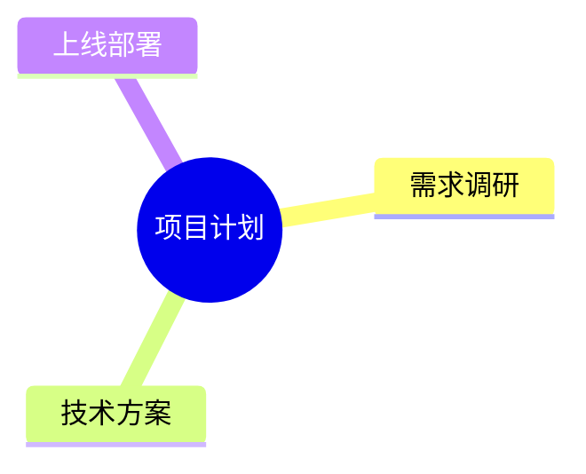
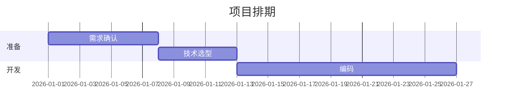
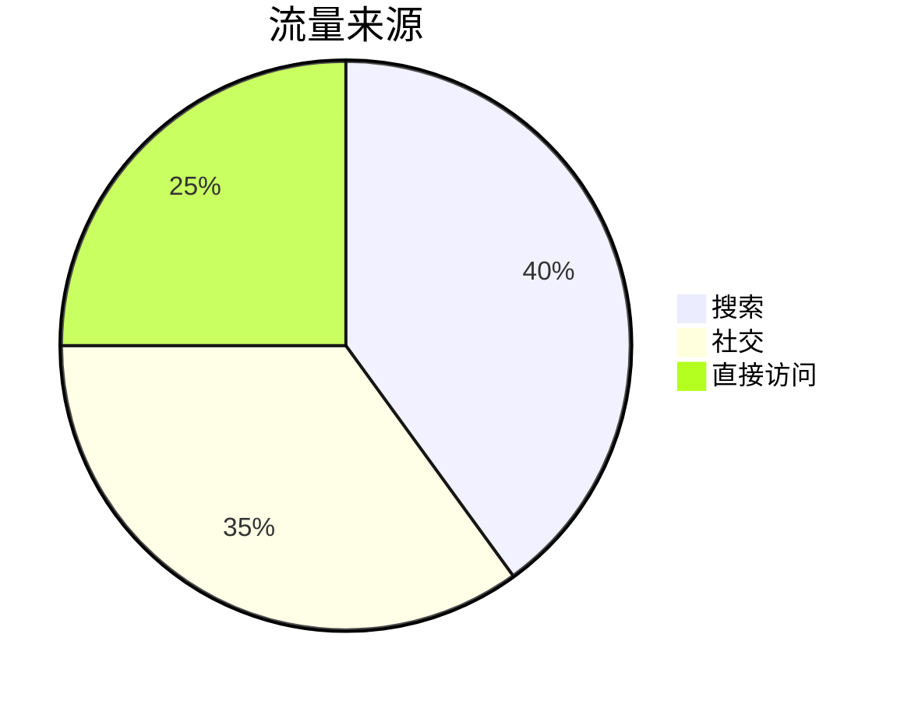
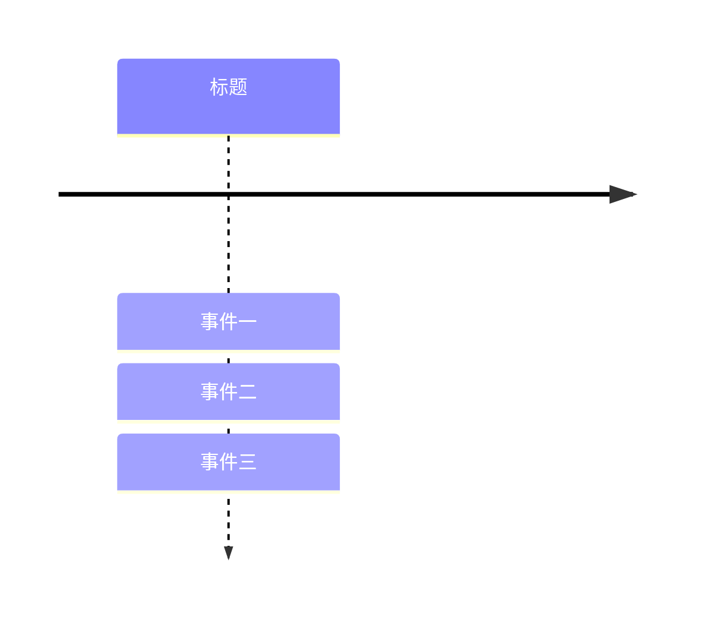
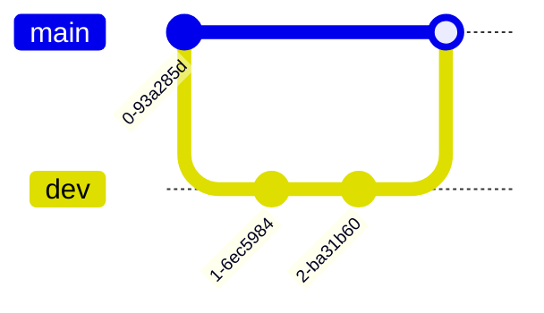
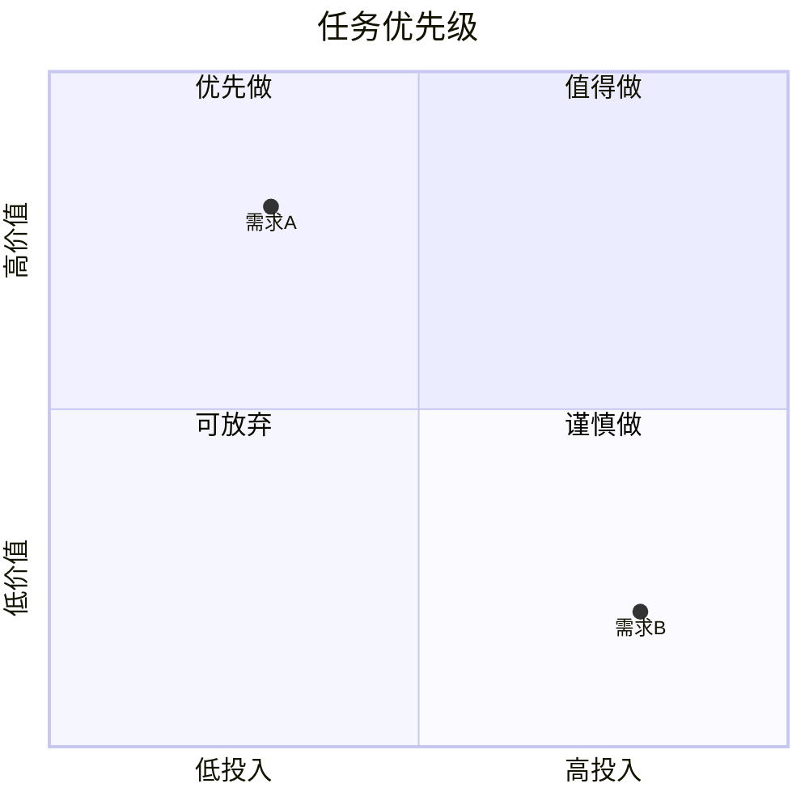

# 第 10 章 进阶图类型一览

> 本章导读：学完前面的流程图、时序图和第 9 章的三张静态结构图，你已经掌握了 mermaid 11.x 里最常用的一批图。但 mermaid 支持 30 多种图！这一章像一张"菜单"，把其余常见图每种给一个能直接复制的最小例子，再配一句话说明它用来干什么。看完你知道"有这张图、长什么样、该去哪查完整语法"就够了。

和之前一样：本教程不需要你敲任何命令。每个例子都是一段**图定义文本**，把它交给智能体渲染，或直接粘到官方在线编辑器 `https://mermaid.live/` 里就能看图。

## 10.1 思维导图 mindmap

用来做发散性的"中心—分支"结构，比如读书笔记、方案脑暴。中心用 `root((文字))` 的双括号表示成一个圆。



- 意思：以"项目计划"为中心，长出三条一级分支。
- 预期：一个从中心向四周发散的树状思维导图。

## 10.2 甘特图 gantt

用来排项目进度，横轴是时间，每条横杠是一个任务。先写 `title` 和 `dateFormat`（日期格式），再用 `section` 给任务分组。



- 意思：`a1` 是任务 id，从 2026-01-01 起做 7 天；`after a1` 表示紧跟上一个任务之后；`14d` 是 14 天。
- 预期：一张横向时间轴，上面按"准备 / 开发"两组排了三条任务横杠。

## 10.3 饼图 pie

用来显示各部分占整体的百分比，最简单的统计图。



- 意思：三类来源，数字就是占比（不必加起来正好 100，Mermaid 会按比例换算）。
- 预期：一个带标题的圆形饼图，三块按比例切分。

## 10.4 时间线 timeline

用来按时间顺序罗列事件，适合做大事记、版本历程。



- 意思：第一行是时间线总标题，后面用冒号分隔依次列出各时间点的事件。
- 预期：一条横向轴，上面均匀排开"事件一 / 事件二 / 事件三"几个节点。

## 10.5 Git 图 gitGraph

用来画分支与提交历史，讲 Git 流程时特别直观。



- 意思：先提交一次；新建并切到 `dev` 分支提交两次；切回 `main` 后把 `dev` 合并进来。
- 预期：一条主分支线，从某点分叉出 dev 支线并各自有提交圆点，最后汇回主线。

> 对智能体说："请把上面这段 gitGraph 代码渲染成图片，预览给我看。"

顺利的话你会看到一张标准的分支合并示意图。

## 10.6 桑基图 sankey

桑基图（sankey）用带宽度的箭头表示"流量从哪流到哪、流了多少"，适合画能量、资金、用户转化等流向。

```mermaid
sankey-beta
    A[100] --> B[40]
    A[100] --> C[60]
    B[40] --> D[40]
```

- 意思：从 A 流出总量 100，分 40 到 B、60 到 C；B 再全流到 D。方括号里的数字是流量大小，线的粗细随之变化。
- 预期：几段粗细不一的彩色箭头连接起 A、B、C、D，越粗代表流量越大。

注意：桑基图的关键字是 `sankey-beta`（目前仍是 beta 阶段）。

## 10.7 象限图 quadrantChart

用横竖两条轴把平面分成四个象限，常做"重要性—紧急度""收益—成本"之类二维评估。



- 意思：先给横轴（投入）和纵轴（价值）标方向，再给四个象限命名；最后用 `点名: [x, y]` 把具体项放到坐标上。
- 预期：一张被十字分成四格的图，每格有标题，两个点分别落在对应位置。

## 10.8 柱状 / 折线图 xychart

`xychart-beta` 用 x、y 轴直接画统计图表，支持 `bar`（柱状）和 `line`（折线）两种。

```mermaid
xychart-beta
    x-axis [一月, 二月, 三月]
    y-axis "销售额" 0 --> 100
    bar [30, 55, 80]
```

- 意思：`x-axis` 列月份，`y-axis` 标数值范围和单位，`bar` 后跟每组对应高度。把 `bar` 换成 `line` 就是折线图。
- 预期：一张带坐标轴的柱状图，三根柱子高度依次升高。

## 10.9 还有更多图

除了上面八种，mermaid 11.x 还能画很多专业图，用到时查官方文档即可（都集中在 `https://mermaid.js.org` 的 syntax 章节）：

- **block**（块图，画系统模块边界）
- **c4**（C4 架构图，分上下文 / 容器 / 组件 / 代码四层）
- **architecture**（部署架构图）
- **wardley**（Wardley 价值链地图）
- **userJourney**（用户旅程图）
- **requirement**（需求图）
- **treemap**（矩阵树图）
- **treeView**（树视图）
- **radar**（雷达图）
- **kanban**（看板图）
- **venn**（维恩图）
- **swimlanes**（泳道图，跨角色的流程）

这些图各自有专长的场景。学到这里你大概明白了：mermaid 的"图类型"非常多，但套路是一致的——**先写一行声明（如 `mindmap`、`gantt`）告诉它画什么，再用该种图专门的语法写内容**。遇到没见过的图，去官网 syntax 章节搜对应名字，照着最小例子改就行。

## 本章小结

这一章把 mermaid 11.x 里常见的"进阶图"各给了一个最小可用例子：思维导图、甘特图、饼图、时间线、Git 图、桑基图、象限图、xy 统计图，并顺带点了一份更长的"图类型清单"。核心心法是——**换图类型就是换第一行声明，其余照官方 syntax 文档改**。

不过你也许已经发现：上面所有图都是"默认长相"，配色和风格都差不多。下一章（第 11 章）我们会学习如何**美化与配置**图表——换主题（theme）、切手绘风（look）、用 `%%{init}%%` 指令临时调整样式，让你的图更贴合场景和审美。
