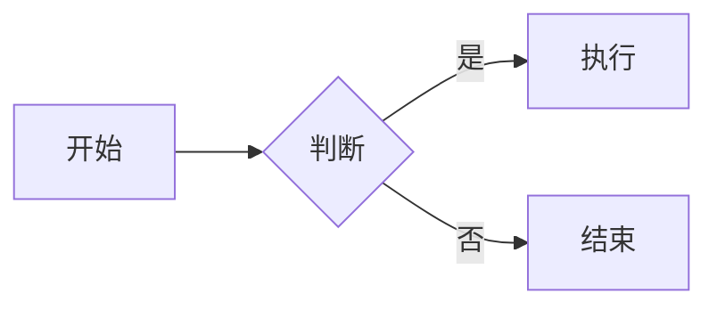

# 第 11 章 配置与主题定制

> 本章导读：前面几章你已经会用 Mermaid 画出流程图、时序图等各种图表了。但有时候你可能希望图表更好看：换个配色、变成手绘风格、或者让某个图临时用深色背景。本章就带你认识 Mermaid 的「配置中心」——`mermaid.initialize({...})`，以及它最常用的几个开关：`theme`（主题）、`look`（外观）、`themeVariables`（配色变量）、`themeCSS`（自定义样式），还有写在图里的临时覆盖指令 `%%{init}%%`。学完之后，你可以随心所欲地把同一段图定义文本，渲染出完全不一样的视觉效果。

## 11.1 配置的入口：`mermaid.initialize`

在 Mermaid 里，所有「全局设置」都要通过一个函数交给它，这个函数叫 `mermaid.initialize`（初始化）。它的作用是：在正式把文本画成图片之前，先告诉 Mermaid「你整体想怎么画」。

打个比方：`mermaid.initialize` 就像餐厅开业前先定好的「厨房规范」——用哪种炉灶、什么摆盘风格、默认咸淡如何。规范定好之后，后面每来一份「食谱」（图定义文本），厨房都按这套规范做菜。

它接收一个配置对象（技术文档里叫 `MermaidConfig`），里面可以放很多开关。最基础的写法是这样的：

```javascript
mermaid.initialize({
  // 这里放各种配置项
});
```

**重要约定**：`mermaid.initialize` 必须在「渲染」之前调用。也就是说，页面加载后、Mermaid 开始画图前，你就要先把它跑一遍。如果你用的是「自动渲染」方式（详见《02-快速上手.md》里的 `<pre class="mermaid">` 写法），通常把 `mermaid.initialize` 放在引入 Mermaid 脚本之后、浏览器扫描元素之前即可；如果你用的是 API 方式（详见《06-浏览器集成与核心API.md》），那就先 `initialize` 再 `run` / `render`。

> 小提示：本教程不需要你亲手敲任何命令。如果你不确定怎么在网页里调用这个函数，对智能体说："请帮我在用 CDN 引入 Mermaid 的 HTML 页面里，加上一段 `mermaid.initialize` 配置，主题是 dark，并在页面加载后自动渲染所有 `class='mermaid'` 的元素。"（自动渲染的写法可参考《04-快速上手.md》里的 `<pre class="mermaid">` 示例）

## 11.2 换主题：用 `theme` 一键变装

`theme`（主题）是 Mermaid 图表整体配色风格的开关。它就像给图表选一套「皮肤」：同一段图，套不同的主题，观感完全不同。

Mermaid 内置了这些主题：

- `default`：默认主题，蓝白配色，干净大方。
- `base`：基础主题，本身比较朴素，专门用来配合 `themeVariables` 做深度改色（后文会讲）。
- `dark`：深色主题，背景接近黑，适合暗色界面或演示大屏。
- `forest`：森林主题，偏绿，清新自然。
- `neutral`：中性主题，灰调克制，适合正式文档。
- `neo`：新版主题，更现代的圆角卡片风格。
- `redux`：另一种深色风格主题。

切换主题非常简单，写在 `initialize` 里就行：

```javascript
mermaid.initialize({
  theme: 'dark'
});
```

这样，之后渲染的所有图都会用深色风格。比如下面这段流程图，在 `dark` 主题下就会变成黑底亮字：



如果你的页面里既有浅色图又有深色图，也可以在不同地方分别调用 `initialize` 多次（每次都会覆盖上一次的设置），或者在单张图里用下一节讲的 `%%{init}%%` 临时覆盖。

## 11.3 换外观：用 `look` 改变「笔触」

除了配色，`look`（外观）控制的是图表的「笔触风格」——是规整的印刷体，还是像手画的。

可选值有三个：

- `classic`：经典风格，规整的方块和直线，默认就是它。
- `handDrawn`：手绘风格，线条带点抖动、像铅笔随手画的。它背后靠一个叫 `roughjs` 的库来实现这种「不规则美感」。
- `neo`：新版风格，配合 `neo` 主题时整体更协调，圆角更明显。

例句如下：

```javascript
mermaid.initialize({
  theme: 'default',
  look: 'handDrawn'
});
```

把 `look` 设成 `handDrawn` 后，你的流程图会立刻多出一种「白板草图」的随性感，做教学课件或头脑风暴时很讨喜。

## 11.4 精细改色：用 `themeVariables` 调色盘

有时候内置主题的颜色你不太满意，比如想让主色块变成淡粉色、想用「微软雅黑」字体。`themeVariables`（主题变量）就是干这个的：它允许你直接改主题内部那些「颜色零件」。

最常用的一些变量：

- `primaryColor`：主节点（矩形、圆角框）的填充色。
- `primaryTextColor`：主节点里的文字颜色。
- `lineColor`：连线的颜色。
- `fontFamily`：全局字体。

例句：

```javascript
mermaid.initialize({
  theme: 'base',
  themeVariables: {
    primaryColor: '#ffcccc',
    fontFamily: '微软雅黑'
  }
});
```

注意上面我们特意用了 `theme: 'base'`。因为 `base` 主题本身就是「半成品皮肤」，最容易被 `themeVariables` 改色；如果你在 `default` 上改，有些颜色可能不生效或被主题本身覆盖。所以**想高度自定义配色，推荐搭配 `base` 主题**。

`themeVariables` 里能改的变量非常多（边框色、背景色、各种图专用的颜色等），不需要一次记全。当你发现某个颜色想调，对智能体说："请帮我在 Mermaid 的 `themeVariables` 里把流程图的连线颜色改成红色、节点背景改成浅蓝。" 智能体会告诉你具体变量名。

## 11.5 注入样式：用 `themeCSS` 写一句自定义 CSS

如果你懂一点 CSS，还可以用 `themeCSS` 直接往渲染出来的 SVG 里「塞」一段样式规则。它适合做更底层、更灵活的微调，比如统一给所有节点加阴影、改字号。

一句话讲清它的定位：**`themeVariables` 是「调色盘」，`themeCSS` 是「自由发挥的画笔」**——前者改已知变量，后者写任意 CSS。例如：

```javascript
mermaid.initialize({
  themeCSS: '.node rect { stroke-width: 2px; }'
});
```

这一句会给所有节点的边框加粗。日常使用，优先用 `themeVariables` 就够了；遇到它改不到的地方，再上 `themeCSS`。

## 11.6 局部临时覆盖：写在图里的 `%%{init}%%`

前面讲的配置都是「全局」的：一旦 `initialize` 写好，整页所有图都跟着变。但有时你只想要**某一张图**临时换个主题，不想动全局设置，怎么办？

Mermaid 提供了一个写在「图定义文本」里的小指令：`%%{init}%%`。它长这样：

```
%%{init: {'theme':'dark','look':'handDrawn'} }%%
graph LR
  A-->B
```

把它放在图定义的**最开头**，这段图就会用 `dark` 主题 + 手绘外观，而其他图不受影响。注意 `%%{init}%%` 后面跟的是一段 JSON 格式的配置（放在花括号里），写法要和 JavaScript 对象一致，键名用单引号或双引号都行。

这个指令特别适合：在 Live Editor 里快速试不同风格、或者在文档里让某张图「特立独行」。常见用法举例：

```
%%{init: {'theme':'forest','themeVariables':{'primaryColor':'#d0f0c0'}} }%%
graph TD
  A[需求] --> B[设计]
  B --> C[开发]
```

## 11.7 安全级别：再提一次 `securityLevel`

在《06-浏览器集成与核心API.md》里我们简单碰过 `securityLevel`（安全级别），这里再强调一遍，因为它和「能不能交互、能不能写 HTML」直接相关。

- 默认值是 `strict`（严格）：最安全，Mermaid 会过滤掉图里的 HTML 标签，也不会启用点击交互。适合处理「不可信来源」的图。
- 如果你想让节点可点击、可绑定交互，要写成 `loose`（宽松）：

```javascript
mermaid.initialize({
  securityLevel: 'loose'
});
```

- 此外还有 `sandbox` 和 `antiscript` 两个更细的档位：`sandbox` 在宽松基础上额外加沙箱限制；`antiscript` 则会拦截图里的脚本注入，兼顾一定交互与安全。一般初学者用 `strict` 或 `loose` 就够，遇到「想交互但不放心」时再考虑后两者。

## 11.8 自动还是手动：`startOnLoad`

最后一个常用开关是 `startOnLoad`（页面加载时是否自动开画）。

- 它默认是 `true`：也就是说，页面一加载，Mermaid 就自动扫描所有 `class="mermaid"` 的元素并渲染。这就是「零 JS 自动渲染」最省事的原因。
- 如果你把它设成 `false`，Mermaid 就「按兵不动」，需要你之后手动调用 `mermaid.run()` 或 `mermaid.render(...)` 才会画图：

```javascript
mermaid.initialize({
  startOnLoad: false
});

// 之后在某个合适的时机（比如按钮点击后）手动触发
mermaid.run();
```

什么时候要关掉自动？比如你希望等用户点某个按钮、或等数据从后台拿到之后再画图，那就设 `false` 然后手动 `run`。

## 本章小结

这一章我们逛完了 Mermaid 的「设置面板」：

- 所有全局配置都从 `mermaid.initialize({...})` 进入，且要在渲染前调用；
- `theme` 一键换皮肤（default / base / dark / forest / neutral / neo / redux）；
- `look` 换笔触（classic / handDrawn / neo）；
- `themeVariables` 是调色盘，精细改色推荐搭配 `base` 主题；
- `themeCSS` 是自由画笔，写任意 CSS；
- `%%{init}%%` 写在图定义开头，让单张图临时覆盖全局配置；
- `securityLevel` 默认 `strict`，要交互就改 `loose`；
- `startOnLoad` 默认 `true`，设 `false` 就得手动 `run`。

图能画、能美化，理论上你已经可以应付绝大多数日常需求了。但实战中难免遇到「图怎么不显示」「语法报错看不懂」之类的问题。下一章《12-常见问题与故障排查及进阶二次开发.md》就带你排查这些坑，并顺带看看 Mermaid 还能怎么「玩出花」——比如接入外部图插件、参与开源贡献。
